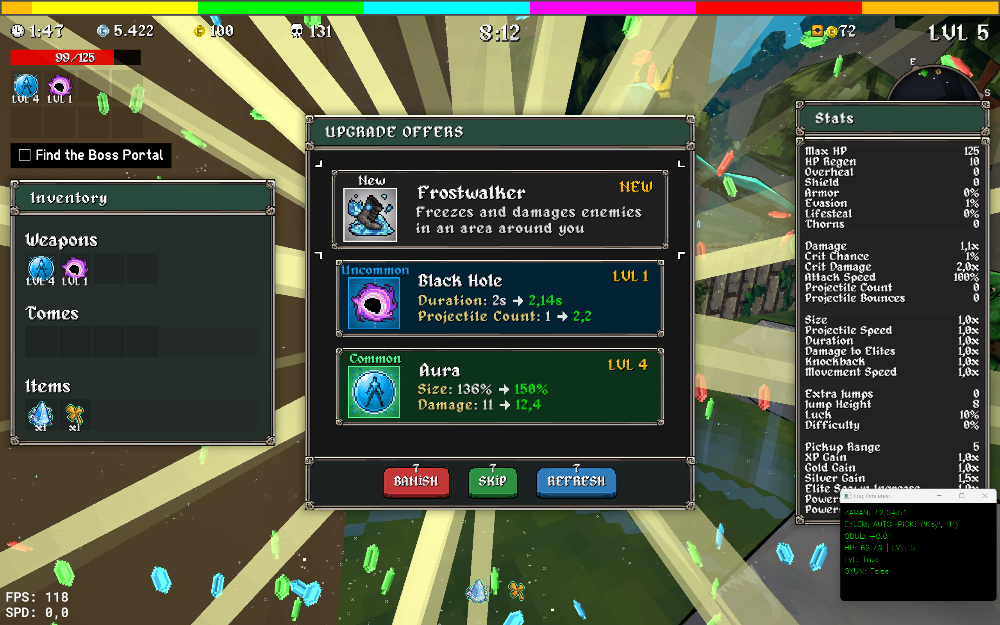

# Megabonk Oyun Botu

Bu repo, Megabonk oyunu için ekran görüntüsü + görüntü işleme ile durum okuyup, `gymnasium` ortamı üzerinden `stable-baselines3 PPO` ajanı eğitebilen ve çalıştırabilen bir bottur. En güçlü tarafı, **kapsamlı debug/kalibrasyon araçları** ile farklı çözünürlük, UI ölçeği ve pencere konumlarında hızlı ayar yapılabilmesidir.

> Not: Bu README özellikle “debug tool’lara ekran görüntüsü (SS) ekleyebileceğin” şekilde şablonlu yazıldı. İlgili yerlere görsel ekleyebilmen için hazır başlıklar ve yer tutucular var.

---

## İçindekiler

- [Hızlı Başlangıç](#hızlı-başlangıç)
- [Proje Mimarisi](#proje-mimarisi)
- [Kurulum](#kurulum)
- [Çalıştırma](#çalıştırma)
  - [Mod 1: Eğitim](#mod-1-eğitim)
  - [Mod 2: Eğitilmiş ajanı çalıştırma](#mod-2-eğitilmiş-ajanı-çalıştırma)
- [Debug ve Kalibrasyon Araçları](#debug-ve-kalibrasyon-araçları)
  - [1) Bölge Debug (Tek seferlik screenshot)](#1-bölge-debug-tek-seferlik-screenshot)
  - [2) Canlı Bölge Debug (Live overlay)](#2-canlı-bölge-debug-live-overlay)
  - [3) Şablon Bölge Fine Tune (Otomatik tespit)](#3-şablon-bölge-fine-tune-otomatik-tespit)
  - [4) Level Up Seçenek Slot Ayarı](#4-level-up-seçenek-slot-ayar)
  - [5) HP Bar Kalibrasyon Modu](#5-hp-bar-kalibrasyon-modu)
- [Konfigürasyon](#konfigürasyon)
- [Assets Yapısı](#assets-yapısı)
- [Sık Karşılaşılan Sorunlar](#sık-karşılaşılan-sorunlar)
- [Geliştirme Notları](#geliştirme-notları)
- [Lisans / Uyarı](#lisans--uyarı)

---

## Hızlı Başlangıç

1) Oyunu aç, pencere başlığının `config.py` içindeki `OYUN_PENCERE_ADI` ile aynı olduğundan emin ol.  
2) Region/şablon/slot ayarlarını debug araçlarıyla doğrula (özellikle ilk kurulumda).  
3) `main.py` ile menüden **Eğitim** veya **Çalıştır** modunu seç.
4) Şöyle gözükmeli:



---

## Proje Mimarisi

Temel parçalar:

- **`GameEnv` (Gym ortamı):** Ajanın eylem uzayı, gözlem vektörü, reward hesaplama, input gönderme (PyAutoGUI) gibi akışı yönetir.  
- **`ScreenMonitor` (arka planda ekran izleme):** Oyun penceresini sürekli yakalar, `InfoExtractor` ile “HP / level up / game over” gibi sinyalleri çıkarır ve env’e en güncel state’i verir.
- **`InfoExtractor`:** Ekrandan sinyal okuma katmanı.  
  - HP: renk maskesi ile yüzde hesaplar  
  - LevelUp/GameOver: template matching ile tespit eder  
  - LevelUp item tarama: `assets/good_items/*.png` ile slotlarda item bulur (mask destekli)

---

## Kurulum

### Gereksinimler

- Python 3.10+ önerilir
- Windows’ta çalışmaya daha uygun (PyAutoGUI + pencere başlığıyla yakalama)

### Bağımlılıklar

Aşağıdaki kütüphaneler bu projede kullanılıyor (dosyalardan görünenler):

- `opencv-python` (cv2)
- `numpy`
- `mss`
- `pyautogui`
- `gymnasium`
- `stable-baselines3`
- `torch`

Örnek kurulum:

```bash
python -m venv .venv
# Windows:
.venv\Scripts\activate
# Linux/Mac:
# source .venv/bin/activate

pip install -U pip
pip install opencv-python numpy mss pyautogui gymnasium stable-baselines3 torch
```

> Not: `torch` kurulumu OS/GPU’ya göre değişebilir. CUDA kullanacaksan resmi PyTorch yönergelerini takip et.

---

## Çalıştırma

### `main.py` menüsü

Botun ana giriş noktası `main.py` içinde bir menü sunar:

- 1: Modeli Eğit
- 2: Eğitilmiş ajanı çalıştır
- 3: Çıkış

```bash
python main.py
```

### Mod 1: Eğitim

Eğitim akışı `train.py` üzerinden `start_training()` fonksiyonuyla başlar. Varsayılan olarak:

- Model yolu: `models/ppo_final_model.zip`
- `PPO("MlpPolicy", ...)`
- Tensorboard log: `./ppo_tensorboard_logs/`
- Toplam adım: `1_000_000`
- Render callback: her 5 step’te env render penceresi güncellenir

Çalıştırmak için menüde **1** seç.

### Mod 2: Eğitilmiş ajanı çalıştırma

Eğitilmiş model varsa `models/ppo_final_model.zip` yüklenir ve ajan sürekli oyun oynar.  
Durdurmak için `CTRL+C`.

Çalıştırmak için menüde **2** seç.

---

## Debug ve Kalibrasyon Araçları

Bu repo, “neden okumuyor / neden yanlış basıyor / neden region kaydı” gibi sorunları hızlı teşhis etmek için ayrı script’ler içeriyor.

Aşağıda her araç için: amaç, nasıl çalıştırılır, neye bakılır ve README’ye koyman için SS placeholder’ları var.

---

### 1) Bölge Debug (Tek seferlik screenshot)

**Dosya:** `debug_regions.py`

Ne yapar:

- Oyun penceresinden **tek seferlik** screenshot alır
- `InfoExtractor` ile değerleri okur (HP, LevelUp, GameOver)
- Ayarlı region’ları görüntü üzerine kutu olarak çizer (HP search, LevelUp, GameOver, ayrıca MAP region varsa)

Çalıştırma:

```bash
python debug_regions.py
```

Beklenen çıktı:

- Terminalde okunan değerleri yazdırır
- Bir OpenCV penceresinde region kutuları çizilmiş ekranı gösterir

SS ekle:

- `docs/screenshots/debug_regions_overlay.png`  
  - Örnek açıklama: “HP/LevelUp/GameOver bölgeleri doğru yerde mi?”  
  - (Buraya görsel ekle)

```md

```

---

### 2) Canlı Bölge Debug (Live overlay)

**Dosya:** `debug_live_regions.py`

Ne yapar:

- Oyun penceresini sürekli yakalar (loop)
- LevelUp ve GameOver template matching skorlarını **canlı** hesaplar
- Region kutularını (HP, LevelUp, GameOver) ekrana çizer
- Sağ altta sabit bir debug penceresi açmaya çalışır (ekran boyutuna göre konumlandırır)

Çalıştırma:

```bash
python debug_live_regions.py
```

Kapatma:

- Debug penceresinde `q`

Neye bakılır:

- `LevelUp Eslesme: 0.xx` ve `GameOver Eslesme: 0.xx` skorları
- Skorlar eşik üstüne çıkıyor mu?
- Kutular doğru UI öğelerini kapsıyor mu?

SS/GIF ekle:

- `docs/screenshots/debug_live_regions.png` veya kısa GIF  
  - (Buraya görsel ekle)

---

### 3) Şablon Bölge Fine Tune (Otomatik tespit)

**Dosya:** `fine_tune_regions.py`

Ne yapar:

- `assets/levelup_template.png`, `assets/gameover_template.png` ve (varsa) `assets/map_template.png` şablonlarını yükler
- Tüm ekran üzerinde `cv2.matchTemplate` ile arar
- Skor belli bir eşiği geçince terminale “kopyala-yapıştır” koordinat çıktısı verir
- Skor `>= 0.99` olunca “tam eşleşme” olarak print’i kilitler (tekrar yazmaz)

Çalıştırma:

```bash
python fine_tune_regions.py
```

Akış:

1) Oyunu aç  
2) LevelUp veya GameOver ekranını görünür yap  
3) Terminalde düşen satırı `get_infos.py` içine yapıştır

Örnek çıktı formatı:

```text
>> LEVELUP_REGION = (x, y, w, h)  [Skor: 0.9xx]
```

SS ekle:

- `docs/screenshots/fine_tune_regions.png`  
  - (Buraya görsel ekle)

---

### 4) Level Up Seçenek Slot Ayarı

**Dosya:** `find_levelup_slots.py`

Ne yapar:

- LevelUp ekranındaki 3 seçim kutusunun (slot) koordinatlarını elle ayarlatır
- Seçili slotu yeşil, diğerlerini kırmızı çizer
- Çıkışta terminale `LEVELUP_OPTIONS = [...]` listesi basar (kopyalanıp `get_infos.py` içine yapıştırılır)

Kontroller:

- `1 / 2 / 3`: hangi slot düzenlenecek
- `W/A/S/D`: taşı (yukarı/sol/aşağı/sağ)
- `I/J/K/L`: boyut (yükseklik/genişlik)
- `Q`: kaydet ve çık

Çalıştırma:

```bash
python find_levelup_slots.py
```

SS ekle:

- `docs/screenshots/find_levelup_slots.png`  
  - (Buraya görsel ekle)

---

### 5) HP Bar Kalibrasyon Modu

**Dosya:** `calibrate_hp_v3.py` (repo içinde bu içerikte)

Ne yapar:

- HP bar okunacak “y ekseni offset”ini ve “mavi bar (mana/kalkan) geldiğinde kayma miktarı”nı elle kalibre eder
- Ekranda iki çizgi gösterir:
  - Yeşil: normal okuma satırı
  - Sarı: mavi bar algılanırsa kaydırılmış okuma satırı
- Terminalde çıkışta “OFFSET” ve “SHIFT” değerlerini verir

Kontroller:

- `W / S`: Yeşil çizgi (offset) yukarı/aşağı
- `A / D`: SHIFT artır/azalt
- `Q`: kaydet ve çık

Çalıştırma:

```bash
python calibrate_hp_v3.py
```

Çıkış örneği:

```text
>>> KAYDEDİLECEK DEĞERLER: OFFSET=..., SHIFT=...
```

Bu değerleri nereye yazacağım?

- `get_infos.py` içindeki HP okuma parametreleri (ör. `STANDARD_OFFSET`, `BLUE_SHIFT`, `SLICE_HEIGHT`) mantıksal olarak burada kalibre ediliyor. Kendi projende tek kaynağa bağlamak için bu değerleri config’e alıp `InfoExtractor._get_current_hp()` içinde kullanmak iyi olur.

SS ekle:

- `docs/screenshots/hp_calibration.png`  
  - (Buraya görsel ekle)

---

## Konfigürasyon

Bu projede pencere yakalama ve action map gibi ayarlar `config.py` üzerinden bekleniyor. Örnek olarak `utils.get_game_window_region()` şu sabitleri kullanıyor:

- `OYUN_PENCERE_ADI`: PyAutoGUI ile pencere başlığı eşleştirme

Ayrıca `game_env.py` içinde şunlar import ediliyor:

- `ACTION_SPACE_SIZE`
- `ACTION_MAP`
- `OYUN_PENCERE_ADI`

Önerilen `config.py` şablonu:

```python
# config.py (örnek)

OYUN_PENCERE_ADI = "Megabonk"  # oyun penceresinin başlığı

# Aksiyonlar:
# GameEnv içindeki ACTION_MAP kullanımı: (command_type, command_value)
# command_type: "nop" | "key" | "sequence"
ACTION_MAP = {
    0: ("key", "w"),
    1: ("key", "a"),
    2: ("key", "s"),
    3: ("key", "d"),
    4: ("key", "q"),
    5: ("key", "e"),
    6: ("key", "space"),
    7: ("key", "1"),  # level up seçim 1
    8: ("key", "2"),  # level up seçim 2
    9: ("key", "3"),  # level up seçim 3
    # ...
}
ACTION_SPACE_SIZE = len(ACTION_MAP)
```

> Not: Kendi oyunun inputlarına göre `ACTION_MAP`’i düzenlemelisin.

---

## Assets Yapısı

`InfoExtractor` ve fine-tune script’i şu dosya/klasörleri bekler:

- `assets/levelup_template.png`
- `assets/gameover_template.png`
- (opsiyonel) `assets/map_template.png`
- `assets/good_items/*.png` (item ikon şablonları)

Item şablonlarında alpha kanal varsa maske olarak kullanılır; yoksa düz template matching yapılır.

Öneri:

- Aynı item’in farklı UI durumları varsa (parlaklık, hover, farklı çözünürlük), ayrı png’ler ekleyip isimlendirmeyi standardize et.

---

## Sık Karşılaşılan Sorunlar

### Oyun penceresi bulunamıyor

Belirti:

- `HATA: '...' başlıklı pencere bulunamadı.`

Çözüm:

- `config.py` içindeki `OYUN_PENCERE_ADI` değerini oyunun gerçek pencere başlığıyla eşleştir  
- Oyunun penceresi açık ve görünür olsun  
- Bazı oyunlar “admin” izinleri ister; botu da aynı izin seviyesinde çalıştır

### HP hep -1 veya 0 çıkıyor

Olası nedenler:

- `HP_SEARCH_REGION` yanlış (HP bar artık o bölgede değil)
- HP bar rengi/tonları farklı (HSV eşikleri uyuşmuyor)
- UI ölçeği değişti

Çözüm adımları:

1) `debug_regions.py` ile HP arama bölgesinin doğru yerde olduğuna bak  
2) `calibrate_hp_v3.py` ile offset/shift mantığını doğrula  
3) Gerekirse `HP_COLOR_LOW/HIGH` ve `BLUE_COLOR_LOW/HIGH` HSV aralıklarını güncelle

### LevelUp/GameOver tespit etmiyor

Olası nedenler:

- Template dosyaları yok / yanlış path
- Eşik (threshold) çok yüksek veya düşük
- `LEVELUP_REGION` / `GAMEOVER_REGION` yanlış

Çözüm:

1) `fine_tune_regions.py` ile region’ı otomatik tespit et ve `get_infos.py` içine yapıştır  
2) `debug_live_regions.py` ile canlı skorları izle  
3) Template’i güncelle: UI değiştiyse yeni screenshot ile yeniden oluştur

### LevelUp item seçimi saçmalıyor

Olası nedenler:

- `LEVELUP_OPTIONS` slot koordinatları yanlış
- `assets/good_items` şablonları eksik veya ölçek uyuşmuyor
- Eşik `0.75` çok yüksek/düşük

Çözüm:

1) `find_levelup_slots.py` ile slotları ayarla  
2) Slot crop’larını SS al ve item template’leri ölçek uyumlu üret  
3) Gerekirse `scan_levelup_screen` eşiklerini ince ayarla

---

## Geliştirme Notları

- `ScreenMonitor` ayrı thread’de çalışır; `latest_game_state` ve `latest_raw_obs` üzerinden env’e veri sağlar.
- `GameEnv.step()` LevelUp görünüyorsa “forced_action” ile otomatik item seçer ve hareket tuşlarını bırakır.
- Invalid action’lara (ör. LevelUp ekranında hareket tuşu) ekstra negatif reward uygulanır.

İyileştirme fikirleri:

- HP/SHIFT gibi kalibrasyon değerlerini tek yerde (config) tutmak
- Template matching yerine daha sağlam yöntem (örn. OCR veya feature matching) gerekirse eklemek
- Eylem uzayını “keyDown süreleri” veya “kombolar” için genişletmek

---

## Lisans / Uyarı

Bu bot, oyunların kullanım şartlarına aykırı olabilir. Kendi sorumluluğunla kullan.

